# Energy Portfolio Management  
_A reproducible pipeline for electricity demand ramps, risk metrics, Monte Carlo hedging, and ESG dashboards – England & Wales Electricity Market_

**Author:** Oleksandr Skytchenko  
**Date:** October 3, 2025  
**Purpose:** Data-driven portfolio management and residual ramp risk assessment for electricity trading.

---

## Executive Summary

This project implements a **4-part reproducible pipeline** to quantify and manage electricity demand ramps in **England & Wales**. Using historical half-hourly data (2009–2024), the workflow produces:

- Gross vs residual ramp metrics
- Day-ahead & week-ahead **Monte Carlo simulations/stress tests**
- Intraday exceedance heatmaps and cumulative extremes
- Residual MWh exposures post-hedging

The system enables traders, stakeholders, and regulators to **visualize and mitigate risk effectively**.

---

## Workflow Diagram

```mermaid
flowchart TD
    %% RAW DATA
    RAW["Raw Data: historic_demand_2009_2024.csv"]

    %% PIPELINE MODULES
    A["Part 1: Data Cleaning & Feature Engineering"]
    B["Part 2: Ramp Metrics & Risk Engine"]
    C["Part 3: Monte Carlo Simulation"]
    D["Part 4: Dashboard & Plots"]

    %% FLOW
    RAW --> A --> B --> C --> D

    %% PART 1 FEATURES
    A1["Hourly & Daily Totals"] --> A
    A2["LDC Curves: Gross & Residual"] --> A
    A3["Intraday Profiles"] --> A

    %% PART 2 RAMP METRICS
    B1["Gross vs Residual Ramps"] --> B
    B2["Extreme Ramp Percentiles 90-95-99"] --> B
    B3["Residual Cluster Analysis"] --> B

    %% PART 3 MONTE CARLO
    C1["Day-Ahead Block Bootstrap"] --> C
    C2["Week-Ahead Block Bootstrap"] --> C
    C3["VaR95 Residual Exposure"] --> C

    %% PART 4 PLOTS WITH THUMBNAILS + CSV LINKS
    D1["[Dashboard LDC](plots/dashboard_ramps_ldc.png)<br>[CSV](outputs/ldc_6mo.csv)<br><img src='plots/dashboard_ramps_ldc.png' width='120'>"] --> D
    D2["[Panel 3 Ramps](plots/panel3_ramps.png)<br>[CSV](outputs/ramp_stats_6m_gross_residual.csv)<br><img src='plots/panel3_ramps.png' width='120'>"] --> D
    D3["[Residual Ramp Box & Scatter](plots/residual_ramp_box_scatter.png)<br>[CSV](outputs/residual_cluster_stats_6m_mc.csv)<br><img src='plots/residual_ramp_box_scatter.png' width='120'>"] --> D
    D4["[Day-Ahead MC Plot](plots/panel_mc_day_ahead.png)<br>[CSV](outputs/daily_extreme_mwh_6m_mc.csv)<br><img src='plots/panel_mc_day_ahead.png' width='120'>"] --> D
    D5["[Week-Ahead MC Plot](plots/panel_mc_bootstrap.png)<br>[CSV](outputs/bootstrap_mc_summary_1week_mc.csv)<br><img src='plots/panel_mc_bootstrap.png' width='120'>"] --> D
    D6["[Intraday Exceedance Heatmap](plots/intraday_exceedance_heatmap.png)<br>[CSV](outputs/intraday_exceedance_heat_6m_mc.csv)<br><img src='plots/intraday_exceedance_heatmap.png' width='120'>"] --> D
    D7["[Cumulative Extreme Ramps](plots/portfolio_extreme_ramps_cumulative.png)<br>[CSV](outputs/portfolio_extreme_ramps_cumulative.csv)<br><img src='plots/portfolio_extreme_ramps_cumulative.png' width='120'>"] --> D
    D8["[Residual LDC & Hedge Stress](plots/residual_ldc_6mo.png)<br>[CSV](outputs/ldc_residual_6mo.csv)<br><img src='plots/residual_ldc_6mo.png' width='120'>"] --> D
    D9["[Uncovered MWh Boxplot](plots/uncovered_mwh_boxplot.png)<br>[CSV](outputs/uncovered_mwh_hedge_test.csv)<br><img src='plots/uncovered_mwh_boxplot.png' width='120'>"] --> D
    D10["[Recent 6-Month Ramps](plots/Panel3_Combined_Recent_6M.png)<br>[CSV](outputs/recent_ramps_6mo.csv)<br><img src='plots/Panel3_Combined_Recent_6M.png' width='120'>"] --> D

```

## 1. Raw Data

**Source:** National Grid ESO – England & Wales (2009-2024) 
**File:** `historic_demand_2009_2024.csv` 
**Frequency:** 48 half-hour intervals per day × 365 days/year × 16 years  
**Dataset Size:** Raws: 279,264; 4,234,560 half-hourly observations of demand history 
**Date Range:** 2009-01-01 → 2024-12-31  

This dataset captures **gross system demand, residual demand, renewable generation, interconnector flows, and storage assets** at a half-hourly resolution. It forms the foundation of the **Energy Portfolio Coordinator Pipeline**.

### Core Variables  

| Variable | Description |
|----------|-------------|
| **datetime** | Timestamp (UTC, half-hourly, 2009–2024) |
| **settlement_date** | Settlement day (YYYY-MM-DD) |
| **settlement_period** | Half-hour slot index (1–48) |
| **demand_mw** | Gross system demand (MW) |
| **res_demand_mw** | Residual demand after renewable offset (MW) |
| **embedded_wind_generation** | Wind generation output (MW) |
| **embedded_wind_capacity** | Installed wind capacity (MW) |
| **embedded_solar_generation** | Solar generation output (MW) |
| **embedded_solar_capacity** | Installed solar capacity (MW) |
| **non_bm_stor** | Non-Balancing Mechanism storage (MW) |
| **pump_storage_pumping** | Pumped storage consumption (MW) |
| **ifa_flow**, **ifa2_flow** | Interconnector flows France–UK (MW) |
| **britned_flow** | Interconnector flow Belgium–UK (MW) |
| **moyle_flow** | Interconnector flow N. Ireland–UK (MW) |
| **east_west_flow** | Interconnector flow Ireland–UK (MW) |
| **nemo_flow** | Interconnector flow Netherlands–UK (MW) |
| **is_holiday** | Binary holiday flag (1 = yes, 0 = no) |

---

**Why it matters:**  
- Provides **granular insights** into system balancing.  
- Enables **residual ramp risk quantification**.  
- Supports **hedging & Monte Carlo bootstrapping**.  
- Aligns with **ESG & market compliance tracking**.  

## Basic Statistics & Risk Metrics

<!-- STATS_TABLE2_START -->
|Metric              |        Gross        |      Residual       |                    Insight                     |
|:-------------------|:-------------------:|:-------------------:|:----------------------------------------------:|
|n observations      |       279238        |       279238        |      Full period half-hourly observations      |
|Mean                | -0.0210716306519887 | -0.026719142810076  |             Average ramp magnitude             |
|SE                  |  1.94576464996718   |  2.24595851202163   |     Ramp variability across all intervals      |
|95% CI Lower        |  -3.83477034458766  |  -4.42879782637248  |         Lower bound of 95% CI for mean         |
|95% CI Upper        |  3.79262708328369   |  4.37535954075233   |         Upper bound of 95% CI for mean         |
|Median              |         -88         |        -117         |             Typical ramp (median)              |
|q01                 |        -2073        |      -2329.63       |      1st percentile — extreme low events       |
|q05                 |        -1573        |        -1723        |         5th percentile — low-end tail          |
|q10                 |        -1239        |        -1363        |         10th percentile — lower decile         |
|q25                 |        -465         |        -653         |        25th percentile — lower quartile        |
|q75                 |         435         |         562         |        75th percentile — upper quartile        |
|q90                 |        1185         |  1466.30000000002   |         90th percentile — upper decile         |
|q95                 |        1812         |        2114         |         95th percentile — extreme ramp         |
|q99                 |        3057         |        3332         |          99th percentile — tail risk           |
|Min / Max           |   -37137 / 38612    |   -40032 / 39124    |          Historical minimum / maximum          |
|Skewness            |  0.62522365273039   |  0.576380068784506  |      Asymmetry of distribution — skewness      |
|Kurtosis            |  85.9367246671235   |  59.5954708254496   |     Peakedness of distribution — kurtosis      |
|t-stat (mean≠0)     | -0.0108294858025836 | -0.0118965433542339 |            Mean ≈ 0 check — t-stat             |
|p-value (mean≠0)    |  0.991359497103397  |  0.990508164123299  |          p-value confirming mean ≈ 0           |
|Jarque-Bera stat    |  80048970.3353325   |  37282649.7518516   |      Jarque-Bera statistic for normality       |
|JB p-value          |          0          |          0          |         JB p-value for normality test          |
|VaR95 uncovered MWh |         NA          |      32515.575      | VaR95 — residual energy exposure after hedging |

<!-- STATS_TABLE2_END -->
*Table 1: Descriptive Statistics of Gross and Residual Ramps (Full Period)*
**Key Insights:**  
- **Residual ramps expose the counterfactual variability**, showing what system swings would be if predictable demand effects were absent.  
- **Fat tails remain** even after hedging; the 95th and 99th percentiles highlight rare but extreme events.  
- **Mean stability confirmed** (t-tests p ≈ 0.99) — deviations are purely variance-driven, no systemic bias.  
- **Skewness and kurtosis** reveal asymmetry and heavy tails; hedging reduces moderate swings but extreme events persist.  
- **VaR95 uncovered MWh** quantifies exposure risk, guiding operational and financial decisions for short- and long-term strategies. 

<!-- COMPARATIVE_TABLE_START -->
|Metric                                 |6M Gross         |6M Residual      |Full Gross         |Full Residual      |Insight                                           |
|:--------------------------------------|:----------------|:----------------|:------------------|:------------------|:-------------------------------------------------|
|N obs                                  |8786             |8786             |279238             |279238             |Number of half-hour observations                  |
|Mean (MW)                              |0.22             |-0.49            |-0.02              |-0.03              |Average half-hour ramp                            |
|SD (MW)                                |768.44           |1141.74          |1028.2             |1186.83            |Ramp volatility                                   |
|Median (MW)                            |-90              |-147             |-88                |-117               |Typical half-hour ramp                            |
|q95 (MW)                               |1382.75          |2083.5           |1812               |2114               |95th percentile: extreme but realistic            |
|q99 (MW)                               |2351.15          |3189.75          |3057               |3332               |99th percentile: tail risk                        |
|Min / Max (MW)                         |**-2172 / 3314** |**-4343 / 5608** |**-37137 / 38612** |**-40032 / 39124** |Historical extremes                               |
|t-stat (mean≠0)                        |0.03             |-0.04            |-0.01              |-0.01              |t-test for mean≠0                                 |
|p-value (mean≠0)                       |0.979            |0.968            |0.991              |0.991              |p-value associated with t-test                    |
|Diff in Means (Gross-Residual, t-test) |0.71             |0.71             |0.01               |0.01               |Difference in means Gross-Residual                |
|Diff in Variances (F-test)             |0.45             |0.45             |0.75               |0.75               |Difference in variances Gross-Residual            |
|VaR95 uncovered MWh                    |648121           |648121           |20540238.5         |20540238.5         |Potential uncovered energy exposure after hedging |
|Cov(6M Residual, Full Residual)        |NA               |1303571.58       |NA                 |NA                 |Covariance between 6M and full residual ramps     |
|Corr(6M Residual, Full Residual)       |NA               |1                |NA                 |NA                 |Correlation between 6M and full residual ramps    |

<!-- COMPARATIVE_TABLE_END -->

*Table 2: Comparative Descriptive Statistics of Gross and Residual Ramps (6M vs Gross)*

# **Key Insights:** 
## Tail risk captured in short-term residuals
- The 6-month residual ramps (q95: 2083.5 MW; q99: 3189.75 MW) are already are already close to full-period extremes (q95: 2114 MW; q99: 3332 MW). 
- Even a short observational window captures extreme events, allowing **rapid scenario simulations and short-term hedging decisions**.

## Residual volatility dominates gross demand
- The standard deviation of 6M residual ramps (1141 MW) is significantly higher than the gross (768 MW).
- Full-period residual SD (1186.83 MW) confirms residual volatility remains dominant over gross (1028.2 MW).  
- By stripping out predictable demand, the underlying variability is exposed — akin to measuring the “pure alpha” of a system. 
- This isolates the counterfactual effect of the residual computation, highlighting risk not visible in aggregate demand.

## Stable mean, variance-driven risk
- T-tests show that residual means for 6M and full datasets are essentially zero (p > 0.95), confirming **no systemic drift**. 
- Risk is in the fluctuations, not bias  — focus should be on **volatility clusters**, not directional bets.
- Interpretation: the “treatment” changes dispersion, not level.

## Covariance confirms representativeness of 6M
- Covariance (6M residual vs full residual: 1,303,571 MW²) and correlation (≈1) show that short-term data mirrors long-term dynamics. 
- High-fidelity short-term observations are sufficient for robust inference and hedging decisions.

## Potential exposure and hedging opportunities
- 6M VaR95 uncovered MWh: 648,121 MWh (~3% of full-period exposure 20,540,238 MWh). This highlights actionable insights for **hedging sizing, storage allocation, and operational contingency planning**.

## Asymmetry in residuals
- Median residual ramps (-147 MW) are more negative than gross (-90 MW), suggesting  **frequent downward corrections**. 
- Tail behavior highlights **asymmetric risk**, advising traders and policymakers to focus on mitigating downward excursions.

## Operational & policy takeaway
- From our perspective, these residuals quantify the **counterfactual: what would happen if predictable demand were neutralized**.  
- High correlation with full-period residuals ensures that **short-term interventions and hedging strategies are robust and scalable**.

### Notes

- All plots are generated in `plots/` and CSV outputs are saved in `outputs`.
- Metadata for each run is captured (R version, session info, RNG seed, timestamp) and can be saved to `outputs/metadata_run.json` for reproducibility and auditing.

# Setup / Configuration (R)

## Setup / configuration
library(tidyverse)
library(lubridate)
library(tsibble)
library(zoo)
library(feasts)
library(fable)
library(boot)        # block bootstrap
library(DBI)
library(RPostgres)   # or odbc::odbc()
library(glue)
library(scales)
library(ggplot2)

# Reproducibility
SEED <- 2025
set.seed(SEED)
RNGkind("L'Ecuyer-CMRG")

# Optional: log metadata
save_run_metadata <- function(file = "outputs/metadata_run.json") {
  if (!dir.exists(dirname(file))) dir.create(dirname(file), recursive = TRUE)
  meta <- list(
    seed = SEED,
    rngkind = RNGkind(),
    time = as.character(Sys.time()),
    R = R.Version()$version.string,
    session = capture.output(sessionInfo())
  )
  jsonlite::write_json(meta, file, pretty = TRUE, auto_unbox = TRUE)
  message("Run metadata saved to: ", file)
}

save_run_metadata()

# Enterprise & Future Opportunities

- **Database-ready:** Fully compatible with PostgreSQL or other relational databases for historical and real-time storage.
- **Automated workflows:** Supports daily/weekly risk reporting and trading desk dashboards.
- **Data enrichment:** Extensible to fetch climate and renewable energy (RES) datasets for integrated portfolio analytics.
- **Machine Learning ready:** Prepared for residual ramp prediction, anomaly detection, and risk optimization pipelines.
